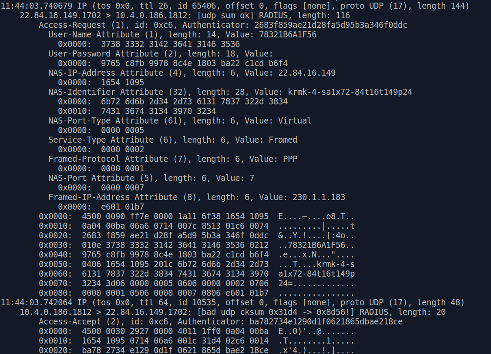

## radius server для управление доступом к мультикасту пользователей IPTV 

Решение собрано на трех контейнерах:

- [mysql](mysql/README.md)
- [freeradius](freeradius/README.md)
- [oracli](oracli/README.md)

Пример успешной авторизации:

- **radtest.py** - скрипт тестирования radius сервера (с передачей Framed-IP-Address реквизита)