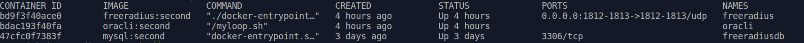

## radius server для управление доступом мультикастом пользователей IPTV 

Решение собрано на трех контейнерах:

- [mysql](mysql/README.md)
- [freeradius](freeradius/README.md)
- [oracli](oracli/README.md)

