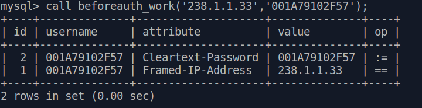
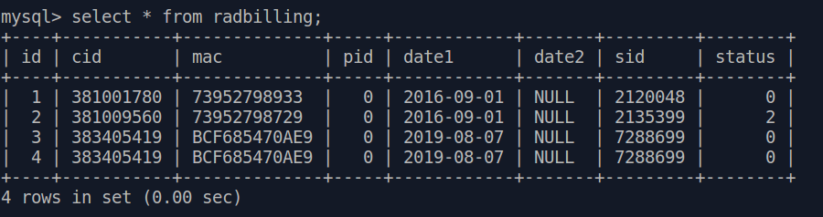

## Сервер баз данных (mysql) ver 5.6.44

- **Dockerfile** - для создания образа
- **beforeauth.sql** - хранимая процедура **beforeauth_work**
- **build.sh** - скрипт создания образа
- **creare_stru.sql** - команды sql создания структуры таблиц
- **initdb.sh** - скрипт создания структуры базы, загрузки хранимых процедур
- **iptvcanals.sql** - для загрузки в таблицу **IPTV_canals** 
- **iptvpackets.sql** - для загрузки в таблицу **IPTV_packets**
- **loadcanals.sh** - скрипт загрузки данных в таблицы **IPTV_canals**, **IPTV_packets**, **radfreecharge**
- **loadpackets.sh** - вспомогательный скрипт
- **myvars.cnf** - переопределение переменный сервера mysql
- **procedures.sql** - хранимые процедуры
- **redfreecharge.sql** - список открытых каналов
- **radpackets.sql** - данные для загрузки в таблицу **radpackets**
- **runmysql.sh** - скрипт создания контейнера
- **freeradiusdb.service** - служба systemd

Пример вывода хранимой процедуры **beforeauth_work**

Фрагмент таблицы **radbilling**

